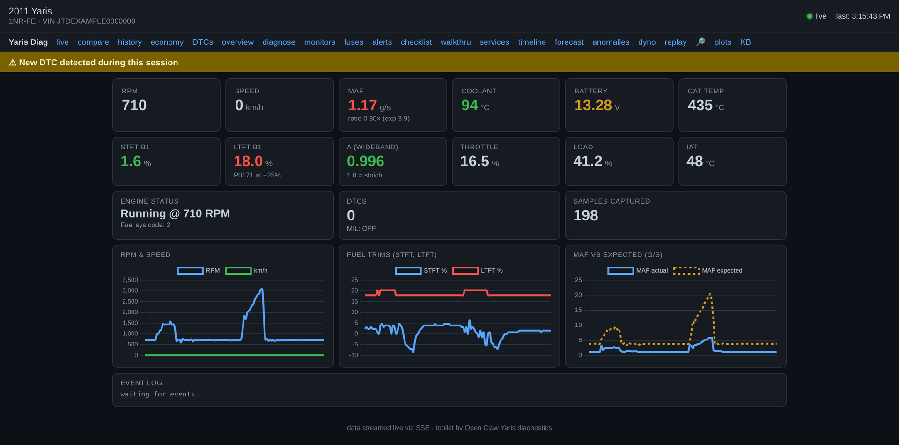

# Toyota Yaris (XP90, 2006–2012) — Repair Knowledge Base + OBD2 Diagnostics

A two-part, owner-built resource for keeping a second-generation **Toyota Yaris
(XP90)** on the road:

1. **`repair-kb/`** — a structured repair wiki (engine, fuel, cooling, brakes,
   suspension, transmission, electrical, body) plus a 127-entry DTC database,
   torque/fluid specs, a maintenance schedule, and the 20 most common XP90
   problems with ranked causes and DIY fixes.
2. **`diag/`** — a Python OBD2 toolkit that talks to the car over a cheap
   Bluetooth ELM327 adapter: live dashboards, fuel-trim/MAF analysis, before/
   after repair verification, readiness monitors, catalyst efficiency, a web
   dashboard, and a knowledge base that cross-links DTCs straight into the wiki.

It was built diagnosing a real 2011 Yaris 1NR-FE with a chronic **P0101 / MAF**
fault, then generalized so other owners can use it on their own car. It is
shared in the hope it helps someone fix theirs.

> The original car has since gone to the scrapyard (two crashes and a failed
> transmission — RIP). The research lives on here.

> 🛠️ **Want to build something like this for your own car?** Start with
> [**docs/BUILD-YOUR-OWN-OBD-TOOLKIT.md**](docs/BUILD-YOUR-OWN-OBD-TOOLKIT.md) —
> a from-scratch guide: what an ELM327 is, where to buy one (and which to avoid),
> how you talk to it, and the exact method used to turn a $10 dongle into this
> toolkit so you can recreate it for whatever you drive.

## Which engine / market does this cover?

Primarily the **1NR-FE 1.3L** and related **NR/NZ** four-cylinders in the XP90
Yaris/Vitz/Belta (2006–2012). Generic OBD2 (mode 01/03/etc.) works on any
OBD2 car; the Toyota-specific bits (mode 21/22 layouts, expected-value tables,
DTC notes) are tuned for this platform. Other vehicles can be added via profile
files — see "Multi-vehicle" below.

---

## Part 1 — Repair knowledge base (`repair-kb/`)

Pure Markdown, no tooling required — browse it on GitHub or locally.

| File | Contents |
|------|----------|
| `engine/ENGINE_REPAIR.md` | Engine procedures (1NR-FE) |
| `engine/DTC_FULL_DATABASE.md` | 127 diagnostic trouble codes, symptoms, ranked causes, fixes |
| `fuel/`, `cooling/`, `brakes/`, `suspension/`, `transmission/`, `electrical/`, `body/` | Per-system guides |
| `specs/TORQUE_SPECS.md`, `specs/FLUID_SPECS.md` | Torque and fluid references |
| `guides/COMMON_PROBLEMS.md` | Top 20 XP90 issues with DIY difficulty + cost |
| `guides/MAINTENANCE_SCHEDULE.md` | Service intervals |

---

## Part 2 — OBD2 diagnostics toolkit (`diag/`)

The toolkit includes a browser dashboard (`./yaris-diag web`) — live gauges,
fuel-trim / MAF charts, DTC alerts, replay, and a dyno power-curve view. Below
it is running against the bundled [`examples/sample_drive.csv`](diag/examples/sample_drive.csv),
so you can see it with no car attached:



> The sample log is a real cold-start idle pull showing the chronic **P0171 /
> MAF** lean condition (LTFT pinned at +25 %) that this project was built to chase.

### Hardware
- A Bluetooth **ELM327** adapter (the ~$10 clones work; PIN is usually 1234/0000).
- A Linux host with BlueZ. Developed on a built-in/USB Bluetooth controller.

### Install
```bash
git clone https://github.com/crcctcpr/yaris-xp90-repair.git
cd yaris-xp90-repair/diag
python3 -m pip install -r requirements.txt   # pyserial (matplotlib optional)
```

### Connect the adapter (one-time pairing)
The fiddly part with ELM327 clones is BlueZ timing out on the PIN. A helper is
included:
```bash
# terminal 1: auto-answer the PIN
sudo python3 bt_pair_agent.py --pin 1234

# terminal 2: scan, pair, bind to a serial port
sudo bluetoothctl -- scan on        # wait ~15 s, note your adapter's MAC
sudo bluetoothctl -- pair <MAC>
# if bluetoothctl's own agent still hijacks the PIN, pair via D-Bus directly:
sudo dbus-send --system --print-reply --dest=org.bluez \
    /org/bluez/hci0/dev_<MAC_with_underscores> org.bluez.Device1.Pair
# bind to /dev/rfcomm0  (note: many clones use SPP channel 2, not 1)
sudo rfcomm bind rfcomm0 <MAC> 2 && sudo chmod 666 /dev/rfcomm0
```

### Use it
```bash
cd diag
./yaris-diag connect       # verify the link
./yaris-diag healthcheck   # one-shot "is my car OK?"
./yaris-diag dash --log reports/drive.csv   # live dashboard, logs to CSV
./yaris-diag dtc P0101     # look up a code (cross-links into repair-kb/)
./yaris-diag web           # browser dashboard at http://localhost:8080
```

Repair-verification workflow (the original use case):
```bash
./yaris-diag dash --log reports/before.csv   # baseline drive
# ... perform the repair (e.g. clean/replace the MAF) ...
./yaris-diag dash --log reports/after.csv    # repeat drive
./yaris-diag verify --before reports/before.csv --after reports/after.csv
```

### Subcommands
`connect pull dash scan sniff tpms clear readiness analyze verify coldstart cat
healthcheck mode06 enhanced drive web history plot economy dtc kline` — run
`./yaris-diag <cmd> --help` for flags.

### Safety model
Everything is **read-only** except `clear`, which performs an audited OBD2
mode-04 clear (snapshot → clear → snapshot). The toolkit never uses risky
services (security access 27, routine control 31, write-by-id 2E, programming
34–37, etc.). It only *reads* your car.

### Try it with no car attached
The bundled example drive log lets you exercise the analysis offline:
```bash
./yaris-diag analyze diag/examples/sample_drive.csv     # from repo root
./yaris-diag dtc P0101
python3 -m unittest discover yaris/tests                # 62 unit tests
```

### Multi-vehicle
Vehicle specifics live in `diag/yaris/vehicles/<VIN>.toml`. Copy
`_template.toml`, fill in your VIN / adapter MAC / expected-value tables, then
select it with `--vehicle <VIN>` or `YARIS_VIN=<VIN>`. The bundled
`JTDEXAMPLE0000000.toml` is a placeholder example for a 2011 Yaris 1NR-FE —
**replace the VIN and adapter MAC with your own.**

---

## Disclaimer

This is community/hobbyist documentation and tooling, provided as-is with no
warranty (see [LICENSE](LICENSE)). It is **not** affiliated with Toyota. Torque
figures, fluid specs, and procedures may contain errors — always cross-check
against the factory service manual for your exact market/model before relying on
them. Working on vehicles and brakes carries risk; if you are unsure, consult a
professional. You are responsible for your own safety and for complying with
local emissions and right-to-repair regulations.

## License

MIT — see [LICENSE](LICENSE). Contributions and corrections welcome.
